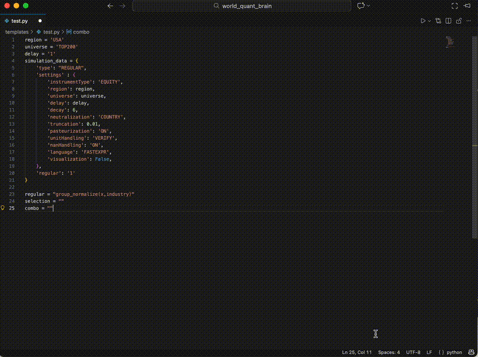

# Brain DataField & Operator IntelliSense

[English Version](./README_EN.md)

[](https://marketplace.visualstudio.com/items?itemName=Roshameow.field-operator-hints)
[](https://marketplace.visualstudio.com/items?itemName=Roshameow.field-operator-hints)
[](https://marketplace.visualstudio.com/items?itemName=Roshameow.field-operator-hints)



一个轻量级的 VSCode 插件，提供**悬停文档**和**自动补全**功能，用于自定义的**数据字段**和**运算符**，基于你自己的 JSON 文档。

非常适用于领域特定语言（DSL）、金融建模 DSL 或内部运算符库。

---

## ✨ 功能

✅ **悬停文档**
在代码中悬停自定义数据字段或运算符时，立即获取相应的描述信息。

✅ **自动补全建议**
输入运算符或字段名称时，提供智能、上下文感知的自动补全。

✅ **Region → Universe / Neutralization 联动提示**
支持从配置的 setting_snapshot.json 中读取 `region`、`universe`、`neutralization` 的级联提示。

✅ **SA Fields 动态补全**
输入 `/` 触发 SA fields 补全。例如，输入 `/selection`，插件会提示 `selection: turnover` 等选项，选中后自动插入 `turnover`。

✅ **基于 JSON 的文档**
通过一个或多个 `.json` 文件来描述你的内部字段/运算符文档，便于维护和扩展。

---

## 🔧 自定义配置

### ✅ 自定义 Operator JSON 文件路径

插件默认读取内置的 `assets/operators_2025.json` 文件。你可以通过 VS Code 设置指定自己的 JSON 文件路径：

```jsonc
{
  "fieldOperatorHints.customOperatorJsonPath": "./my_operators.json"
}
```

### ✅ 自定义 Region 设置 JSON（setting_snapshot.json）路径

如果你有自己的 `setting_snapshot.json` 文件用于 Region → Universe、Neutralization 的枚举配置，也可以指定路径：

```jsonc
{
  "fieldOperatorHints.customRegionSettingJsonPath": "./my_setting_snapshot.json"
}
```

### ✅ 自定义 SA Fields JSON 路径

插件默认读取内置的 `assets/sa_fields.json`。你可以提供自己的 SA Fields 定义文件：

```jsonc
{
  "fieldOperatorHints.customSaFieldsJsonPath": "./my_sa_fields.json"
}
```

### 📌 路径说明

* **相对路径**：以项目根目录为基准（推荐），例如：`./my_operators.json`
* **绝对路径**：完整路径，例如：`/Users/yourname/project/operators.json`

---

## 📄 JSON 文件格式要求

### Operator JSON

```json
[
  {
    "name": "add",
    "category": "Arithmetic",
    "definition": "add(x, y, filter=false), x + y",
    "description": "Add all inputs. If filter=true, NaN will be treated as 0."
  },
  ...
]
```

### SA Fields JSON

这是一个 `组名 -> 字段列表` 的映射：
```json
{
  "selection": [
    "turnover",
    "author_fitness"
  ],
  "combo": [
    "pnl",
    "alpha"
  ]
}
```

### Region Setting JSON（符合 WorldQuant Brain 风格）

需包含如下字段嵌套结构：

```jsonc
{
  "actions": {
    "POST": {
      "settings": {
        "children": {
          "region": {
            "choices": {
              "instrumentType": {
                "EQUITY": [ ... ]
              }
            }
          },
          "universe": {
            "choices": {
              "instrumentType": {
                "EQUITY": {
                  "region": {
                    "USA": [ ... ],
                    "GLB": [ ... ]
                  }
                }
              }
            }
          },
          "neutralization": {
            "choices": {
              "instrumentType": {
                "EQUITY": {
                  "region": {
                    "USA": [ ... ]
                  }
                }
              }
            }
          }
        }
      }
    }
  }
}
```

插件会自动提取可用的 Region、与其对应的 Universe / Neutralization 枚举项，并在 Python 文件中提供智能提示。

---

## 💡 使用建议（强烈推荐）

为了在字符串中（例如 `"TOP1000"`、`'REVERSION_AND_MOMENTUM'`）也能正常触发自动补全，请在 VS Code 的设置中启用以下选项：

### ✅ 开启字符串内自动补全

打开你的用户设置（或项目 `.vscode/settings.json`），添加：

```jsonc
{
  "editor.quickSuggestions": {
    "strings": true
  }
}
```

---

## 💻 重新编译 VSIX 插件

安装 `.vsix` 插件非常简单，只需按照以下步骤操作：

### 1. 打包插件

如果你已经完成插件的开发，并且准备打包，可以通过以下命令将插件打包成 `.vsix` 文件：

```bash
npm install -g vsce
npm run compile
vsce package
```

这将生成一个 `.vsix` 文件，通常为 `your-extension-name-1.0.0.vsix`。

### 2. 安装 VSIX 插件

在 VSCode 中安装 `.vsix` 插件：

1. 打开 VSCode。
2. 点击左侧栏的扩展（Extensions）图标，或者按 `Ctrl+Shift+X` 打开扩展面板。
3. 在扩展面板的右上角，点击 **...** 按钮，选择 **Install from VSIX...**。
4. 选择你刚刚打包的 `.vsix` 文件进行安装。

完成安装后，插件就会自动启用，你可以开始享受自动补全和悬停文档的功能了。

---

## 🛠️ 开发与调试

在插件开发过程中，你可以通过以下步骤进行调试：

1. 在 VSCode 中打开插件项目。
2. 按 `F5` 运行插件，VSCode 会自动启动一个新的窗口来加载并调试插件。
3. 在 `View -> Output -> Extension Host` 查看调试日志，检查插件是否正确加载。